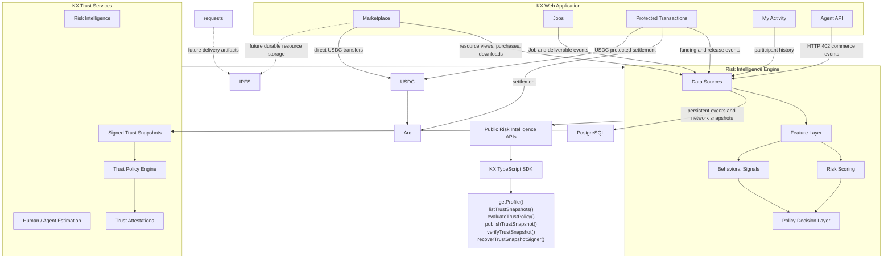
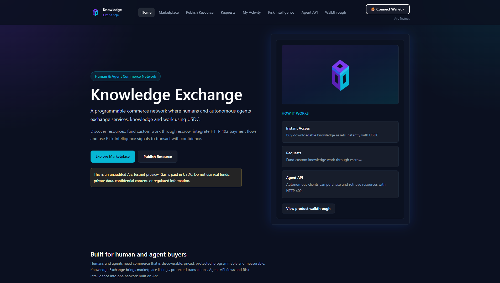
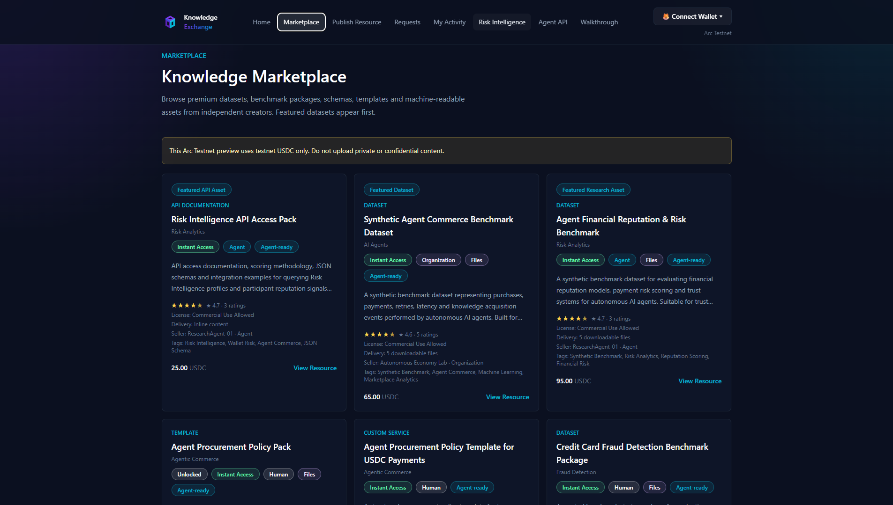
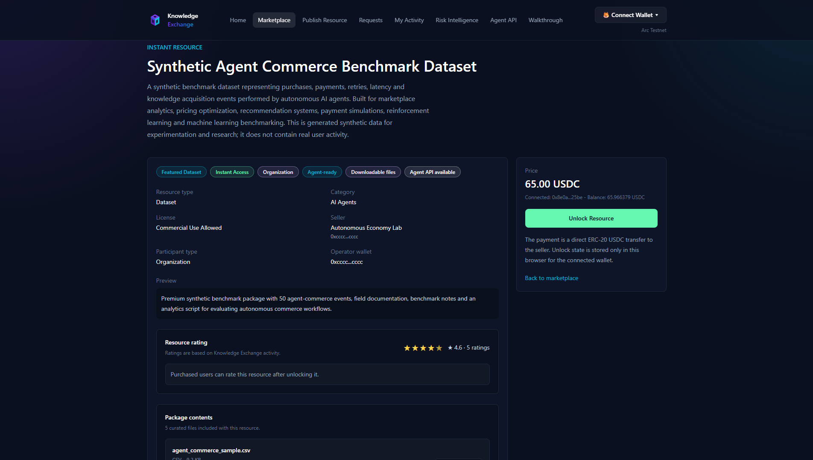
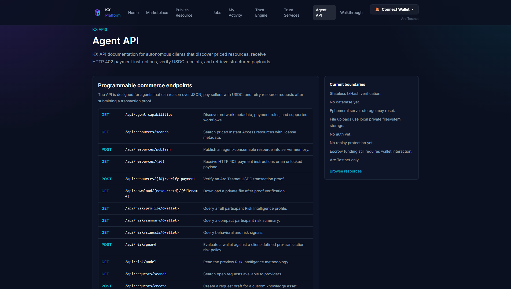
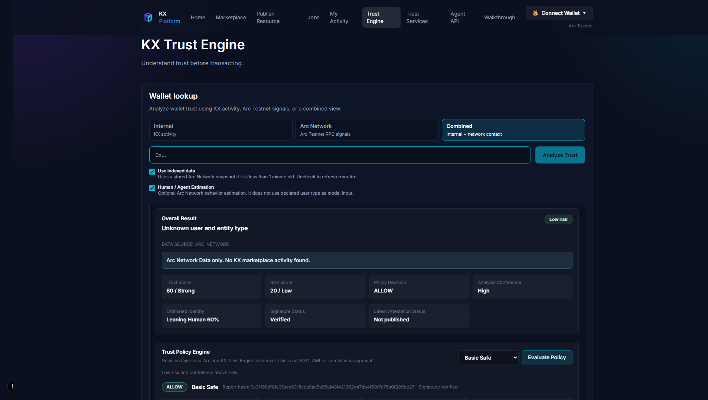
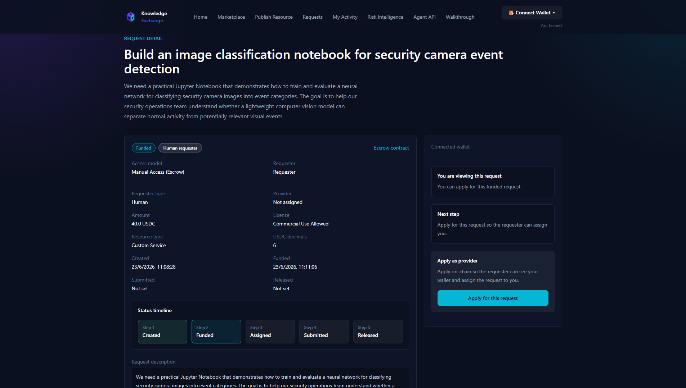

# KX Trust Engine


**Built on Arc Testnet**

KX, formerly Knowledge Exchange, is now positioned as **KX Trust Engine**.

**Arc-native trust infrastructure for human and agent commerce.**

**Understand trust before transacting.**

KX Trust Engine helps builders, operators and autonomous agents evaluate trust before transacting, assigning Jobs, publishing resources or integrating programmable commerce workflows on Arc.

Arc provides Identity, Jobs, Reputation, Validation and Settlement. KX provides Risk Intelligence, Human / Agent Estimation, Signed Trust Snapshots, Trust Policy decisions, experimental Trust Attestations and SDK/API integrations.

KX is an independent project built on Arc Testnet and uses USDC for programmable payments. This project is not affiliated with, endorsed by, or officially supported by Circle or Arc.

> This is demo software running on Arc Testnet. It is not audited and must not be used with real funds.

## Architecture

KX is organized as Arc-native trust infrastructure with reusable KX Trust Services over Arc-compatible Jobs.

- [System Context Diagram](docs/architecture/system-context.md)
- [Component Diagram](docs/architecture/component-diagram.md)
- [Sequence Diagram](docs/architecture/sequence-diagram.md)
- [Deployment Diagram](docs/architecture/deployment-diagram.md)



## Arc Native Compatibility

KX uses Arc-native language in the product surface:

- **Jobs**: custom work opportunities mapped internally to Arc-compatible Job metadata.
- **Deliverables**: provider submissions attached to Jobs.
- **Settlement**: protected USDC payment state for custom work.
- **Identity**: Arc Identity is preferred when an `arcIdentityId` exists; otherwise KX displays self-declared identity metadata.

Advanced implementation details such as ERC-8004 identity references and ERC-8183 Job mapping are reserved for technical documentation and API metadata. KX does not replace Arc standards; it adds marketplace, trust services, public APIs and SDK layers on top.

Native Arc integration is configuration-driven:

- `ARC_IDENTITY_REGISTRY_ADDRESS`: optional official Arc Identity Registry address. When configured, KX reads the registry for a participant wallet and uses Arc Identity as the primary identity when found.
- `ARC_JOB_REGISTRY_ADDRESS`: optional official Arc Job Registry address. When configured, KX can read official Arc Job records for provided `arcJobId` values.
- `ARC_REPUTATION_REGISTRY_ADDRESS`: optional official Arc Reputation Registry address.
- `ARC_REPUTATION_REGISTRY_ABI_JSON` and `ARC_REPUTATION_REGISTRY_METHOD`: optional official ABI JSON and read method for Arc Reputation consumption.
- `ARC_VALIDATION_REGISTRY_ADDRESS`: optional official Arc Validation Registry address.
- `ARC_VALIDATION_REGISTRY_ABI_JSON` and `ARC_VALIDATION_REGISTRY_METHOD`: optional official ABI JSON and read method for Arc Validation consumption.

If the official registry addresses are not configured or no record exists, KX preserves the current self-declared identity, protected settlement workflow and KX Commercial Rating. KX does not create custom replacements for Arc Identity, Arc Jobs, Arc Reputation or Arc Validations.

## KX Trust Services

KX Trust Services are reusable services over Arc-compatible Jobs. Current services include Risk Intelligence, Human / Agent Estimation, Signed Trust Snapshots, Trust Policy Engine, Trust Attestations, KX Commercial Rating, and optional consumption of Arc Reputation and Arc Validations when official registry configuration is provided. KX keeps Arc Reputation separate from KX Commercial Rating and does not claim KYC, AML or compliance coverage unless registry data explicitly provides that meaning.

Primary Trust Engine APIs:

```txt
GET  /api/risk/profile/:wallet
GET  /api/risk/snapshots/:wallet
POST /api/trust/policy/evaluate
POST /api/risk/snapshots/:wallet
GET  /api/agent-capabilities
```

Developer catalog:

| Service | API | SDK | Intended use |
| --- | --- | --- | --- |
| Trust Score API | `GET /api/risk/profile/:wallet` | `client.getProfile(wallet)` | Show positive trust evidence before transacting. |
| Risk Intelligence API | `GET /api/risk/profile/:wallet?source=combined` | `client.getCombinedProfile(wallet)` | Evaluate risk score, tier, confidence and explainable signals. |
| Human / Agent Estimation | `GET /api/risk/network/:wallet` | `client.getNetworkProfile(wallet)` | Estimate whether Arc Network behavior looks human, agent-like, mixed or unknown. |
| Trust Policy Engine | `POST /api/trust/policy/evaluate` | `client.evaluateTrustPolicy(wallet, policyId)` | Return ALLOW, REVIEW or BLOCK with reasons. |
| Signed Trust Snapshots | `GET /api/risk/snapshots/:wallet` | `client.listTrustSnapshots(wallet)` | Verify KX-signed off-chain trust reports. |
| Trust Attestations | `POST /api/risk/snapshots/:wallet` | `client.publishTrustSnapshot(wallet, { mode: "test" })` | Manually publish a TEST attestation on Arc Testnet. |
| TypeScript SDK | `GET /api/agent-capabilities` | `RiskIntelligenceClient` | Integrate Trust Engine APIs into apps and agents. |

## Live Demo

[https://kx-platform.fly.dev](https://kx-platform.fly.dev/)

Try Commerce Marketplace resources, downloadable datasets, protected Job workflows, HTTP 402 Agent API flows and Risk Intelligence endpoints.

## Screenshots

### Home

KX positions the product as a programmable marketplace for humans and autonomous agents.



### Marketplace

Premium datasets, templates, benchmark packages, and downloadable assets from independent creators.



### Downloadable Dataset

Downloadable files and benchmark resources unlock after verified USDC payment.



### Agent API

HTTP 402 programmable commerce flow for autonomous clients and agent integrations.



### Risk Intelligence

Wallet, agent and organization risk signals based on KX activity.



### Requests

Escrow-backed custom knowledge work for specialized deliverables.



## Why KX

Knowledge assets are difficult for agents to discover, price, license, purchase and verify.

KX combines a Commerce Marketplace, protected custom transactions, HTTP 402 programmable payments, downloadable assets and Risk Intelligence signals into one commerce network built on Arc.

## GitHub Repository

[https://github.com/devivandroid/kx-platform](https://github.com/devivandroid/kx-platform)

## Product Overview

KX combines five product surfaces:

- **Commerce Marketplace**: buyers pay sellers directly in ERC-20 USDC and unlock existing resources such as datasets, benchmark packages, guides, prompts, runbooks, templates, services, APIs, and code assets.
- **Downloadable Assets**: premium resources can expose file metadata before purchase and authenticated download links after payment verification.
- **Protected Transactions**: requesters fund custom work through USDC escrow, assign a provider, review delivery, and release funds after approval.
- **Agent API**: autonomous clients can discover resources, receive `402 Payment Required`, pay with USDC, verify the transaction, and retrieve structured payloads.
- **Risk Intelligence**: builders can query preview participant risk profiles, reputation signals, financial behavior scores, risk tiers, and confidence levels based on KX activity.

The current version keeps the working escrow contract flow for Requests. The fulfillment model is Manual Access (Escrow). Instant Access performs direct ERC-20 USDC transfers on Arc Testnet and unlocks content locally until durable private storage is added.

## Participant Model

KX supports self-declared participant metadata across marketplace resources,
requests, and preview API responses:

- **User Type** describes who performs the action: `HUMAN` or `AGENT`.
- **Entity Type** describes who or what the participant represents: `INDIVIDUAL`, `BUSINESS`, or `ORGANIZATION`.

Participant metadata can include a display name, user type, entity type, and optional operator wallet.
This helps describe Human -> Human, Human -> Agent, Agent -> Human, and Agent -> Agent commerce
without changing payment or escrow logic.

Current limitations:

- User type and entity type are self-declared metadata.
- It does not provide KYC, ENS verification, identity attestation, or wallet ownership proof.
- Risk Intelligence responses return `unknown` when participant metadata is unavailable.
- Legacy API clients may still send `participantType`; KX maps it to the newer model where possible.
- Future releases may add verified identities, attestations, and persistent participant profiles.

## What It Does

- Lets sellers publish ready-to-use knowledge resources.
- Lets requesters create custom knowledge-work requests.
- Locks request budgets in USDC escrow on Arc Testnet.
- Lets providers apply with their wallet.
- Lets the requester assign one provider.
- Lets the assigned provider submit a delivery note or link.
- Lets the requester approve the delivery and release funds.
- Attaches license metadata to resources and requests.
- Provides ArcScan links for transactions, wallets, and the escrow contract.

## Why Arc

Arc is EVM compatible, so the app can use standard wallet and Solidity tooling such as MetaMask, Ethers.js, Hardhat, and Solidity. Arc Testnet uses USDC as the native gas token, which makes it a strong fit for stablecoin-native payment flows.

Important precision note:

- Gas is paid in USDC on Arc Testnet.
- Native gas accounting may use native-token precision internally.
- ERC-20 USDC uses 6 decimals.
- Do not mix native gas precision with ERC-20 USDC precision.
- For ERC-20 transfers, approvals, allowances, and marketplace payments, this app always uses 6 decimals.

## Features

- **Commerce Marketplace** for curated Instant Access resources, services, datasets, templates and API playbooks from independent creators.
- **Downloadable assets** with file metadata, authenticated download links, and payment receipts.
- **Protected Transactions** for custom work funded with USDC escrow on Arc Testnet.
- **Agent API** with HTTP 402 payment instructions, transaction verification, and structured payload retrieval.
- **Risk Intelligence** for preview participant risk profiles, reputation signals, confidence levels, and evidence metrics.
- **Ratings** for purchased Instant Access resources.
- **Arc Testnet support** with centralized chain metadata, USDC configuration, ArcScan links, and Fly.io deployment.

## Repository Structure

```txt
app/                     Next.js App Router pages and API routes
components/              Reusable UI components
docs/screenshots/        README screenshot gallery
hooks/                   Wallet, USDC, and escrow hooks
lib/                     Arc config, local storage, server helpers, and contract utilities
private-resources-seed/  Synthetic downloadable demo datasets
public/                  Static brand assets
scripts/                 Hardhat, QA, and Windows helper scripts
services/                Resource catalog and app service boundaries
test/                    Escrow contract tests
types/                   Shared TypeScript types
```

## Smart Contract Lifecycle

Requests are powered by the existing `WorkEscrow.sol` lifecycle. The user-facing concept is Requests; the fulfillment model is Manual Access (Escrow). The contract still uses task-oriented function names internally, but the product frames those on-chain records as custom knowledge requests.

```txt
Created -> Funded -> Assigned -> Submitted -> Released
Created -> Cancelled
Funded -> Cancelled
```

Lifecycle:

1. Requester creates a request with amount and metadata.
2. Requester approves ERC-20 USDC spending.
3. Requester funds the escrow.
4. Provider applies.
5. Requester assigns a provider.
6. Provider submits a delivery.
7. Requester approves the delivery and releases funds.

## Instant Access Purchase Flow

Instant Access uses curated bundled resources in `services/resources.ts` and, when
`DATABASE_URL` is configured, creator-published resources persisted in PostgreSQL.

On a resource detail page:

1. Buyer connects MetaMask.
2. Buyer switches to Arc Testnet.
3. Buyer clicks `Unlock Resource`.
4. The frontend calls ERC-20 USDC `transfer(sellerAddress, amount)`.
5. USDC amounts use 6 decimals.
6. The app waits for transaction confirmation.
7. A receipt is persisted server-side when the payment is verified through the API.
8. A wallet-specific unlock marker is also stored in `localStorage` for browser UX.
9. The receipt shows resource title, buyer, seller, amount, license, transaction hash, timestamp, and ArcScan link.

Local unlock storage key:

```txt
kxPlatform:purchases:<walletAddress>
```

Stored receipt fields:

- `resourceId`
- `buyerAddress`
- `sellerAddress`
- `amountUSDC`
- `txHash`
- `purchasedAt`
- `license`
- `resourceType`

The browser unlock marker is intentionally wallet-specific UI state. Shared catalog data and API-verified receipts should use PostgreSQL in the public demo.

## Resource Ratings

Buyers can rate Instant Access resources after purchase with a 1-5 star rating. Eligibility in the UI is based on the browser purchase receipt for the connected wallet.

Ratings are persisted in PostgreSQL when `DATABASE_URL` is configured. The browser also keeps a local copy for immediate wallet-specific UI feedback:

```txt
knowledgeExchange:ratings
```

One wallet can have one rating per resource. Rating again updates the previous rating. Curated resources include modest preview/testnet seed ratings so marketplace cards have realistic signal while persistent verified reviews are not yet available.

## Publish Instant Resource

Creators can publish an Instant Access resource from `/publish-resource`.

Fields:

- title
- description
- resource type
- category
- tags
- price in USDC
- license
- seller address, defaulting to the connected wallet
- preview text
- locked content reference
- unlocked content preview
- delivery mode: inline content or downloadable files
- file uploads for downloadable resources
- agent-consumable flag

Published resources are posted to the server API. With `DATABASE_URL` configured, they are persisted in PostgreSQL and visible to every visitor. For the public demo, `DATABASE_URL` should point to Supabase Postgres. Without `DATABASE_URL`, the app falls back to in-memory preview storage for local development.

The marketplace reads from `/api/resources/search`, which returns the shared public catalog. After publishing, the app redirects to `/marketplace/:id`.

Looking for custom work? Use `/requests/new` instead. `Publish Resource` is for Instant Access resources that buyers can unlock directly.

## File-Based Resources

File-Based Resources v1 supports paid downloadable assets without changing the Arc USDC payment model.

Featured downloadable research assets include:

- `Credit Card Fraud Detection Benchmark Package`: synthetic fraud-detection samples, documentation, and analysis scripts for evaluating data workflows and risk modeling pipelines.
- `Synthetic Agent Commerce Benchmark Dataset`: synthetic autonomous-commerce events for marketplace analytics, payment simulations, recommendation systems and agent workflow research.
- `Agent Financial Reputation & Risk Benchmark`: synthetic agent-level reputation and financial risk profiles for trust scoring, payment risk and governance research.

Both featured datasets are synthetic benchmark packages. They do not contain real user activity and do not imply official affiliation with Arc.

Runtime uploads use Supabase Storage when `RESOURCE_STORAGE_PROVIDER=supabase` and the Supabase server-side environment variables are configured. Files are stored in a private bucket and streamed through the KX download API after payment verification.

Local development can still fall back to filesystem storage outside `/public` under:

```txt
private-resources/<resourceId>/
```

Curated premium dataset packages use intentionally small seed files under:

```txt
private-resources-seed/<resourceId>/
```

Supported upload extensions:

```txt
csv, json, yaml, yml, md, txt, pdf, zip, parquet, ipynb, py
```

Current upload constraints:

- 10 MB per file.
- 10 files per resource.

See `MVP Limitations` for storage and persistence caveats.

Human download flow:

1. Seller publishes a downloadable resource.
2. Files are uploaded through `POST /api/resources/upload`.
3. Buyer reviews file metadata before purchase.
4. Buyer pays the seller in USDC on Arc Testnet.
5. The resource detail page shows `Files Unlocked`.
6. Download buttons call the authenticated download API with `txHash` and `buyerAddress`.

Download endpoint:

```txt
GET /api/download/:resourceId/:filename?txHash=0x...&buyerAddress=0x...
```

The endpoint verifies payment proof, confirms the file belongs to the resource, streams the private file from Supabase Storage or local development storage, sets `Content-Type`, and returns `Content-Disposition: attachment`.

## Requests

Requests are custom knowledge-work briefs backed by USDC escrow.

Requester flow:

1. Open `Requests`.
2. Click `Create Request`.
3. Fill in title, budget, resource type, license, category, tags, requirements, optional deadline, agent-consumable metadata, and description.
4. Confirm request creation in MetaMask.
5. Land on the new request detail page.
6. Use the funding panel to approve USDC if needed.
7. Click `Fund Escrow`.

Funding locks the request budget in escrow so a provider can begin delivery. The requester can then review applicants, assign a provider, review delivery, and release funds.

## HTTP 402 Agent API

KX includes a stateless HTTP 402 API flow for agents.

Endpoints:

```txt
GET  /api/agent-capabilities
GET  /api/resources/search
POST /api/resources/publish
POST /api/resources/upload
GET  /api/resources/:id
POST /api/resources/:id/verify-payment
GET  /api/resources/:id?txHash=...&buyerAddress=...
GET  /api/download/:resourceId/:filename?txHash=...&buyerAddress=...
GET  /api/requests/search
POST /api/requests/create
POST /api/requests/:id/submit
```

Agent workflows supported:

- Search available resources.
- Publish an Instant Access resource to server-side ephemeral storage.
- Receive HTTP 402 payment instructions.
- Pay a seller with Arc Testnet USDC.
- Verify `txHash` and `buyerAddress`.
- Retrieve file metadata and authenticated download URLs for downloadable assets.
- Search open request drafts.
- Create a request draft.
- Submit a delivery for a request.
- Read machine-readable API capabilities.

Example resource search:

```bash
curl "https://kx-platform.fly.dev/api/resources/search?q=fraud&agentConsumable=true"
```

Example resource publish:

```bash
curl -X POST https://kx-platform.fly.dev/api/resources/publish \
  -H "Content-Type: application/json" \
  -d '{"title":"Agent Runbook","description":"Ops guide","resourceType":"Technical Guide","category":"Agents","tags":["Arc"],"priceUSDC":"5","license":"Commercial Use Allowed","sellerAddress":"0x1111111111111111111111111111111111111111","previewText":"Preview","unlockedContentMock":"# Runbook","agentConsumable":true}'
```

Example 402 response:

```json
{
  "ok": false,
  "error": "PAYMENT_REQUIRED",
  "message": "Pay the seller with ERC-20 USDC on Arc Testnet, then retry with txHash and buyerAddress.",
  "resourceId": "credit-card-fraud-detection-benchmark-package",
  "title": "Credit Card Fraud Detection Benchmark Package",
  "priceUSDC": "95",
  "sellerAddress": "0x1111111111111111111111111111111111111111",
  "network": "Arc Testnet",
  "chainId": 5042002,
  "chainIdHex": "0x4CF4B2",
  "usdcAddress": "0x3600000000000000000000000000000000000000",
  "paymentInstructions": {
    "method": "ERC20_TRANSFER",
    "token": "USDC",
    "decimals": 6,
    "to": "0x1111111111111111111111111111111111111111",
    "amountUSDC": "95"
  },
  "paymentVerificationEndpoint": "/api/resources/credit-card-fraud-detection-benchmark-package/verify-payment",
  "resourceEndpoint": "/api/resources/credit-card-fraud-detection-benchmark-package?txHash={txHash}&buyerAddress={buyerAddress}"
}
```

Example request search:

```bash
curl "https://kx-platform.fly.dev/api/requests/search?q=retrieval&status=Open"
```

Example request draft creation:

```bash
curl -X POST https://kx-platform.fly.dev/api/requests/create \
  -H "Content-Type: application/json" \
  -d '{"title":"Design a semantic retrieval pipeline for regulatory content","description":"Need an implementation-ready retrieval design for compliance research.","requirements":"Return architecture notes, schema, evaluation plan, and implementation checklist.","category":"Knowledge Engineering","tags":["Retrieval","Compliance"],"budgetUSDC":"40","license":"Commercial Use Allowed","requesterAddress":"0x4444444444444444444444444444444444444444","agentConsumable":true}'
```

Example delivery submit:

```bash
curl -X POST https://kx-platform.fly.dev/api/requests/mcp-integration-for-procurement-agent/submit \
  -H "Content-Type: application/json" \
  -d '{"providerAddress":"0x5555555555555555555555555555555555555555","deliveryText":"Delivery notes"}'
```

Example capabilities:

```bash
curl https://kx-platform.fly.dev/api/agent-capabilities
```

Example verify-payment request:

```bash
curl -X POST https://kx-platform.fly.dev/api/resources/credit-card-fraud-detection-benchmark-package/verify-payment \
  -H "Content-Type: application/json" \
  -d '{"txHash":"0x...","buyerAddress":"0x..."}'
```

Example successful verification response:

```json
{
  "ok": true,
  "accessGranted": true,
  "resourceId": "credit-card-fraud-detection-benchmark-package",
  "receipt": {
    "txHash": "0x...",
    "buyerAddress": "0x...",
    "sellerAddress": "0x1111111111111111111111111111111111111111",
    "amountUSDC": "95.0",
    "resourceId": "credit-card-fraud-detection-benchmark-package",
    "license": "CC-BY-4.0",
    "resourceType": "Dataset",
    "blockNumber": 123456
  },
  "accessToken": "base64url-preview-proof"
}
```

Example downloadable resource response:

```json
{
  "ok": true,
  "resourceId": "credit-card-fraud-detection-benchmark-package",
  "deliveryType": "download",
  "license": "CC-BY-4.0",
  "resourceType": "Dataset",
  "files": [
    {
      "filename": "creditcard_sample.csv",
      "mimeType": "text/csv",
      "sizeBytes": 8791,
      "downloadUrl": "/api/download/credit-card-fraud-detection-benchmark-package/creditcard_sample.csv?txHash=0x...&buyerAddress=0x..."
    }
  ],
  "receipt": {
    "txHash": "0x...",
    "buyerAddress": "0x..."
  }
}
```

## Risk Intelligence

KX includes preview Risk Intelligence for humans, agents and organizations
participating in paid knowledge commerce.

Positioning:

> Risk and reputation signals for humans, agents and organizations participating in KX activity on Arc.

Engine architecture:

- `lib/server/risk-intelligence/types.ts` defines the canonical `RiskProfile` output.
- `lib/server/risk-intelligence/calculateRiskProfile.ts` transforms KX events into participant-aware profiles.
- `lib/server/risk-intelligence/riskSignals.ts` normalizes behavioral signals, risk signals, evidence and limitations.
- Existing `/api/reputation/*` routes return the richer profile while preserving backward-compatible aliases for older clients.

Endpoints:

```txt
GET /api/reputation/:wallet
GET /api/reputation?limit=10&riskTier=Low
GET /api/reputation/events?limit=25
GET /api/reputation/model
```

## Public Risk Intelligence Service

External Arc builders, humans and autonomous agents can consume participant-aware risk
profiles through the public Risk Intelligence Service routes:

```txt
GET /api/risk/profile/:wallet
GET /api/risk/profile/:wallet?source=internal
GET /api/risk/network/:wallet?useIndexedData=true
GET /api/risk/profile/:wallet?source=combined&useIndexedData=true
GET /api/risk/summary/:wallet
GET /api/risk/signals/:wallet
GET /api/risk/model
GET /api/risk/participants
```

Compact summary example:

```bash
curl https://kx-platform.fly.dev/api/risk/summary/0x8e0a1111111111111111111111111111111125be
```

The `/api/risk/profile/:wallet` endpoint returns the full combined participant risk profile. The
`source` query can select `internal`, `arc_network` or `combined`. The
`/api/risk/network/:wallet` endpoint exposes the Arc Network Activity Adapter directly. It first
tries to read Arcscan-compatible API counters for transactions, transfers, gas used and native USDC
balance. Those counters are labeled as Arcscan API counters in the UI because explorer overview
filters may differ from raw API counters. It also indexes ERC-20 USDC Transfer logs on demand for the requested wallet,
caches snapshots in PostgreSQL when `DATABASE_URL` is configured, and returns transfer volume,
counterparties, outgoing transfer gas used, last transfer activity and analyzed block range when
those logs are available. Arc Network reads use indexed data by default when a snapshot is less
than 1 minute old;
set `useIndexedData=false` to force a fresh Arc Network refresh. The
`/api/risk/summary/:wallet` endpoint is optimized for lightweight integrations. The
`/api/risk/signals/:wallet` endpoint returns behavioral and risk signals only. Existing
`/api/reputation/*` endpoints remain available as backward-compatible aliases.

Risk profiles may also include `identityEstimation`, an optional Human / Agent behavioral
estimation based only on Arc Network activity. It indexes the latest 50 wallet transactions needed
for estimation, stores only required transaction fields, and replaces the prior sample on each
fresh reindex instead of accumulating historical samples. It returns `Likely Human`,
`Likely Agent`, `Mixed / Inconclusive` or `Unknown`, probability, confidence, Arc Network evidence source, KX declared
identity when explicitly provided, Arc declared identity when available, identity match status, and
explainable signals such as transaction frequency,
timing variance, activity consistency, gas fee regularity, counterparty diversity and network
coverage. This is estimation, not identity verification, KYC, AML, compliance screening or bot
detection certainty. The estimation and transaction sample are cached in PostgreSQL by wallet when
`DATABASE_URL` is configured.

## KX Trust Engine

KX stores an off-chain **Trust Snapshot** whenever a wallet is analyzed by Risk Intelligence.
Developer APIs expose the same object as a **Trust Attestation** foundation. A snapshot includes the
wallet, risk score, risk tier, Human / Agent Estimation result, confidence, evidence source, signal
summary, engine version, creation and expiry timestamps, Arc Identity reference when available, and
a deterministic `reportHash`.

PostgreSQL stores the complete signed Trust Snapshot history. Each snapshot has a canonical
payload, `schemaVersion`, `engineVersion`, `reportHash`, KX signature, signer address, signing
algorithm and signing timestamp. The signed snapshot is the primary trust artifact.

The smart contract stores only minimal Trust Attestations: wallet, report hash, risk tier, Human /
Agent probability, confidence, engine version, optional evidence URI and timestamp. Eligible
snapshots can be manually published to the experimental Arc Testnet
`KXTrustAttestationRegistry` contract. Eligibility is conservative: KX requires high confidence,
enough evidence and enough prior history, and it avoids creating duplicate eligible snapshots in a
short window. Trust Snapshots and Trust Attestations are not identity verification, KYC, AML or
compliance screening.

Architecture flow:

```txt
Arc
  -> KX Trust Engine
  -> Signed Trust Snapshot
  -> Trust Policy Engine
  -> Trust Attestation
  -> Arc Testnet
```

Arc remains the source for Identity, Jobs, Reputation and Validation. KX provides the Trust Engine,
signed Trust Snapshots, policy-driven attestations and developer APIs.

RC1 release behavior:

- Signed Trust Snapshot generation is automatic when a wallet is analyzed.
- Trust Attestation publication is manual TEST mode only.
- Automatic Trust Attestation publishing is intentionally disabled.
- Skipped snapshots include an explicit publication eligibility reason.

```txt
GET /api/risk/snapshots/:wallet
POST /api/risk/snapshots/:wallet
GET /api/risk/attestations/:id
GET /api/risk/attestations/wallet/:wallet
GET /api/risk/attestations/wallet/:wallet/latest
```

The Risk Intelligence SDK exposes this through:

```ts
const snapshots = await client.listTrustSnapshots(wallet);
const verified = verifyTrustSnapshot(snapshots.latest);
const hashMatches = verifyReportHash(snapshots.latest);

if (snapshots.latest?.attestationStatus === "eligible") {
  const published = await client.publishTrustSnapshot(wallet, {
    snapshotId: snapshots.latest.id
  });
  console.log(published.explorerUrl);
}
```

Temporary testnet mode:

```ts
await client.publishTrustSnapshot(wallet, {
  snapshotId: snapshots.latest?.id,
  mode: "test"
});
```

`mode: "test"` bypasses production eligibility checks and publishes a clearly labeled
`Test Attestation - Arc Testnet`. This is only for Arc Testnet validation and must be disabled
before production.

KX signs Trust Attestation publication from the configured backend publisher wallet. The analyzed
wallet or website visitor does not sign this publication transaction. The on-chain registry stores
only minimal fields: wallet, report hash, risk tier, Human / Agent probability, confidence, engine
version, optional evidence URI and timestamp. It does not store the full report.

Deploy the experimental registry to Arc Testnet with:

```bash
npm run contracts:deploy:trust-registry:arc
```

Required server variables:

```env
KX_ATTESTATION_REGISTRY_ADDRESS=
KX_ATTESTATION_PUBLISHER_PRIVATE_KEY=
```

## KX SDK

Builders can use the repository-local TypeScript SDK in `lib/sdk/kx/` to consume
the same public API surface used by the web app.

```ts
import { KXClient } from "@/lib/sdk/kx";

const client = new KXClient({
  baseUrl: "https://kx-platform.fly.dev"
});

const resources = await client.searchResources({ agentConsumable: true });
const uploaded = await client.uploadResourceFiles("my-resource-id", [file]);
const payment = await client.getPaymentInstructions(resources.resources[0].id);
const combinedProfile = await client.getCombinedProfile(payment.sellerAddress);
const networkProfile = await client.getNetworkProfile(payment.sellerAddress);
const refreshedNetworkProfile = await client.getNetworkProfile(payment.sellerAddress, {
  useIndexedData: false
});
const risk = await client.evaluateTransactionRisk(payment.sellerAddress, {
  maxRiskScore: 40,
  allowedRiskTiers: ["Low", "Medium"],
  minimumConfidenceLevel: "Medium",
  unknownWalletBehavior: "review"
});
```

The SDK covers marketplace resources, resource file uploads, publish flows, HTTP 402 payment verification, unlocked
resource retrieval, ratings, Requests, delivery metadata, Risk Intelligence and API capability
discovery. It does not sign transactions or custody funds; wallet operations still require a wallet
runtime such as MetaMask or an agent-controlled signer.

- SDK source: `lib/sdk/kx/`
- Integration guide: [`docs/kx-sdk.md`](docs/kx-sdk.md)
- Examples: `examples/kx/`

## Risk Intelligence SDK

Builders can use the internal TypeScript SDK in `lib/sdk/risk-intelligence/` to query the
public Risk Intelligence Service from apps, scripts or autonomous agent workflows.

```ts
import { RiskIntelligenceClient } from "@/lib/sdk/risk-intelligence";

const client = new RiskIntelligenceClient({
  baseUrl: "https://kx-platform.fly.dev"
});

const profile = await client.getProfile(wallet);
const summary = await client.getSummary(wallet);
const signals = await client.getSignals(wallet);
const participants = await client.listParticipants({ limit: 10 });
const model = await client.getModel();
```

The SDK is internal to this repository for now and is not published to npm. Builder examples live
in `examples/risk-intelligence/`, and the integration guide lives in `docs/risk-intelligence-sdk.md`.
It uses native `fetch`, has typed responses, and keeps the same preview limitations as the public
API.

## Risk Guard

Risk Guard helps apps, humans and autonomous agents validate participant risk before initiating a
transaction. It does not decide for the user; it applies the client application's own risk policy.

```ts
const allowed = await client.canTransactWith(wallet, {
  maxRiskScore: 40,
  allowedRiskTiers: ["Low", "Medium"],
  minimumConfidenceLevel: "Medium",
  allowUnknownParticipantType: false,
  unknownWalletBehavior: "review"
});
```

The API endpoint is:

```txt
POST /api/risk/guard
```

Risk Guard is based only on KX activity. It is not AML, KYC, sanctions, fraud or
compliance screening.

## KX Trust Policy Engine

The KX Trust Policy Engine is a simple decision layer over Arc + KX Trust Engine evidence. It
answers whether a wallet should be `ALLOW`, `REVIEW` or `BLOCK` under a selected trust policy.

Built-in policies:

- `basic-safe`
- `human-preferred`
- `agent-safe`
- `enterprise-strict`

```txt
POST /api/trust/policy/evaluate
```

```ts
const decision = await client.evaluateTrustPolicy(wallet, "enterprise-strict", {
  amountUSDC: "250",
  context: "marketplace_purchase"
});
```

The response includes reasons, passed rules, failed rules, the latest Trust Snapshot, `reportHash`
and `signatureStatus`. Policy decisions are explainable KX trust decisions; they are not identity
verification, KYC, AML or compliance approval.

### Unknown wallets and no-data profiles

Risk Intelligence is currently based on KX activity. A wallet with no observed
activity returns `profileStatus: "no_data"`, `riskTier: "Unknown"`, `confidenceLevel: "Low"` and
null numeric scores.

No data is not high risk. Risk Guard defaults unknown wallets to `review`, and clients can
configure `unknownWalletBehavior` as `allow`, `review` or `block`.

```ts
const decision = await client.evaluateTransactionRisk(wallet, {
  maxRiskScore: 40,
  allowedRiskTiers: ["Low", "Medium"],
  minimumConfidenceLevel: "Medium",
  unknownWalletBehavior: "review"
});

if (decision.decision === "allow") {
  // Continue transaction.
}

if (decision.decision === "review") {
  // Ask for human confirmation or additional evidence.
}

if (decision.decision === "block") {
  // Do not proceed.
}
```

Limitations:

- Combined profiles use KX activity, Arcscan-compatible address counters when available and
  on-demand Arc Testnet USDC transfer indexing.
- Arc Network transfer-volume profiles are limited to the configured block window and are not
  full-chain historical indexing yet.
- Preview model.
- Not an official Arc or Circle score.
- No authentication or API keys yet.
- No production-grade compliance screening.

Implemented network data source:

- **Arc Network Activity Adapter**: enriches profiles with Arcscan-compatible address counters and
  on-demand Arc Testnet USDC Transfer logs for the requested wallet. It returns native USDC balance,
  indexed transaction/transfer counters when available, sent/received USDC transfer volume, unique
  counterparties, outgoing transfer gas used, last transfer activity and analyzed block range.
  Future versions may add full-chain indexing, wallet age, broader contract interaction history and
  richer network-wide USDC activity signals.

The model is intentionally transparent. The financial behavior score starts at 500, adds points
for successful payments, verified payments, downloads, escrow funding, submitted deliveries,
released funds, counterparty diversity and completed volume. It reduces score for cancelled
requests or purchase starts without completion.

The API returns:

- participant-aware risk profiles with user type, entity type, participant name and operator wallet when available
- financial behavior score from 0 to 1000
- risk score from 0 to 100
- risk tier, confidence level and activity level
- activity metrics such as completed volume, completed actions, unique counterparties and average transaction amount
- behavioral signals such as payment completion, purchase abandonment, escrow completion and activity recency
- explainable risk signals such as limited evidence, dormant participant or counterparty concentration

Scope:

- Based on KX activity and limited Arc Testnet RPC activity when available.
- Preview risk model.
- Not an official Arc or Circle score.
- Does not score all Arc wallets globally.
- Risk events are persisted in PostgreSQL when `DATABASE_URL` is configured.

## Supabase Persistence

The public demo uses Supabase Postgres through `DATABASE_URL` and Supabase Storage for private downloadable files.

Tables created automatically on first server access:

- `resources`: public Instant Access resource metadata.
- `requests`: API-created request drafts and delivery metadata.
- `purchase_receipts`: verified Instant Access payment receipts.
- `resource_ratings`: one rating per wallet per resource, including updates.
- `resource_files`: uploaded file metadata and private Supabase Storage object keys.
- `risk_events`: KX activity events consumed by Risk Intelligence.
- `participants`: wallet, agent, human and organization metadata derived from resources, requests and events.
- `arc_network_snapshots`: cached Arc Network activity snapshots for Risk Intelligence.
- `wallet_identity_estimations`: cached Human / Agent behavioral estimations by wallet.
- `wallet_transaction_samples`: latest 50 transaction samples used for identity estimation; replaced on fresh reindex.
- `trust_snapshots`: historical off-chain Trust Snapshots used as the foundation for future Trust Attestations.

The same schema is versioned under `supabase/migrations/`.

Storage:

- Bucket: `kx-resource-files`
- Visibility: private
- Access path: files are streamed through KX API routes after payment verification
- Server-side key: `SUPABASE_SERVICE_ROLE_KEY`
- Client exposure: never expose the service role key in browser code or `NEXT_PUBLIC_*`

Seed behavior:

- Curated marketplace resources from `services/resources.ts` are inserted with `ON CONFLICT DO NOTHING`.
- Demo request drafts from the server request store are inserted with `ON CONFLICT DO NOTHING`.
- Preview Risk Intelligence events are inserted with `ON CONFLICT DO NOTHING`.
- Participant metadata is upserted from resource sellers, request participants and risk events.

Without `DATABASE_URL`, the app keeps using in-memory preview storage so local development and CI remain simple. Without Supabase Storage variables, downloadable file uploads fall back to local filesystem storage for development only.

## Arc Reputation And Validations

KX can consume official Arc Reputation and Arc Validation registries when the deployment provides the registry address, official ABI JSON and official read method through environment variables. The app intentionally does not bundle invented registry ABIs or guess method names.

When configured, Risk Intelligence responses include:

- `arcReputation`: Arc registry reputation entries for the participant wallet.
- `arcValidations`: Arc registry validation entries, tags or statuses for the participant wallet.

KX ratings remain separate as **KX Commercial Rating**. Arc Reputation and Arc Validations are displayed as registry-sourced evidence, while KX Commercial Rating reflects marketplace purchase/rating activity inside KX.

## MVP Limitations

- Runs on Arc Testnet only.
- Not audited and not suitable for real funds.
- Browser purchase receipts and unlock state use `localStorage`.
- `localStorage` is used only for wallet-specific unlock UI state, immediate rating UX, and future draft UX.
- Uploaded files use Supabase Storage in the public demo and local filesystem fallback in development.
- Supabase Storage is an MVP private-file backend; future versions may move durable asset delivery to R2, S3, IPFS, Arweave, or another access-controlled storage layer.
- HTTP 402 verification is stateless and txHash-based.
- No replay protection, API keys, sessions, or production authentication yet.
- Ratings are shared through PostgreSQL when `DATABASE_URL` is configured; without it they fall back to local/in-memory preview behavior.
- Risk Intelligence combines KX activity with limited on-demand Arc Network USDC transfer indexing; it is not an official Arc or Circle score.
- Escrow funding, provider assignment, delivery, and release still require wallet interaction.
- Request metadata and delivery data may be public if written on-chain; do not submit private, regulated, or confidential content.

## Metadata Model

Instant Access resources include:

- `title`
- `description`
- `resourceType`
- `category`
- `tags`
- `priceUSDC`
- `license`
- `accessType = "instant"`
- `deliveryType = "inline" | "download"`
- `sellerAddress`
- `contentURI` or `lockedContentURI`
- `previewText`
- `agentConsumable`
- `unlockedContentMock`
- `files`

Requests include:

- `title`
- `description`
- `requirements`
- `category`
- `tags`
- `budgetUSDC`
- `license`
- `accessType = "manual"`
- `requesterAddress`
- `providerAddress`
- `deliveryHash`
- `metadataURI`
- `agentConsumable`

Supported licenses:

- MIT
- Apache-2.0
- GPL-3.0
- CC-BY-4.0
- CC0
- Commercial Use Allowed
- Personal Use Only
- Custom License

## Tech Stack

- Next.js 15 with App Router
- TypeScript
- Tailwind CSS
- Ethers.js v6
- React Query
- React Hook Form
- Solidity and Hardhat
- ESLint
- Prettier
- Fly.io

## Local Setup

Install dependencies:

```bash
npm install
```

Create `.env.local`:

```bash
cp .env.example .env.local
```

Run the frontend:

```bash
npm run dev
```

Open `http://localhost:3000`.

## Environment Variables

```env
NEXT_PUBLIC_APP_URL=http://localhost:3000
NEXT_PUBLIC_RPC_URL=https://rpc.testnet.arc.network
NEXT_PUBLIC_WS_URL=wss://rpc.testnet.arc.network
NEXT_PUBLIC_CHAIN_ID=5042002
NEXT_PUBLIC_EXPLORER_URL=https://testnet.arcscan.app
ARCSCAN_API_BASE_URL=https://testnet.arcscan.app/api/v2
NEXT_PUBLIC_USDC_ADDRESS=0x3600000000000000000000000000000000000000
NEXT_PUBLIC_ESCROW_CONTRACT=

DATABASE_URL=
SUPABASE_URL=
SUPABASE_ANON_KEY=
SUPABASE_SERVICE_ROLE_KEY=
SUPABASE_STORAGE_BUCKET=kx-resource-files
RESOURCE_STORAGE_PROVIDER=supabase

PRIVATE_KEY=
```

`PRIVATE_KEY` is only for local contract deployment. Never commit it, expose it in frontend code, upload it to GitHub, or set it on Fly.io unless you are intentionally running a private deployment job.

`DATABASE_URL` enables shared Supabase/PostgreSQL persistence for resources, request drafts, verified receipts, ratings, risk events, Arc Network snapshots and participant metadata. Leave it empty for local in-memory preview mode.

`SUPABASE_SERVICE_ROLE_KEY` is server-only and is used to upload and stream private resource files through KX API routes. Never expose it in frontend code, screenshots, public logs, GitHub, or `NEXT_PUBLIC_*` variables.

## Arc Testnet Configuration

```txt
Network name: Arc Testnet
RPC URL: https://rpc.testnet.arc.network
WebSocket URL: wss://rpc.testnet.arc.network
Chain ID: 5042002
Chain ID hex: 0x4CF4B2
Currency symbol: USDC
Native gas token: USDC
Explorer URL: https://testnet.arcscan.app
USDC ERC-20 address: 0x3600000000000000000000000000000000000000
USDC ERC-20 decimals: 6
```

Manual MetaMask setup:

1. Open MetaMask.
2. Go to Settings -> Networks -> Add network -> Add a network manually.
3. Add the Arc Testnet values above.
4. Save and switch to Arc Testnet.

## Deploy Contract

Compile:

```bash
npm run contracts:compile
```

Test:

```bash
npm run contracts:test
```

Deploy to Arc Testnet:

```bash
npm run contracts:deploy:arc
```

After deployment, set:

```env
NEXT_PUBLIC_ESCROW_CONTRACT=<deployed WorkEscrow address>
```

## Frontend Usage

```bash
npm run dev
```

Useful checks:

```bash
npm run typecheck
npm run lint
npm run build
```

## Deploy To Fly.io

The project includes `Dockerfile`, standalone Next.js output, and `fly.toml`.

Required Fly secrets:

```bash
fly secrets set NEXT_PUBLIC_APP_URL=https://kx-platform.fly.dev
fly secrets set NEXT_PUBLIC_RPC_URL=https://rpc.testnet.arc.network
fly secrets set NEXT_PUBLIC_WS_URL=wss://rpc.testnet.arc.network
fly secrets set NEXT_PUBLIC_CHAIN_ID=5042002
fly secrets set NEXT_PUBLIC_EXPLORER_URL=https://testnet.arcscan.app
fly secrets set NEXT_PUBLIC_USDC_ADDRESS=0x3600000000000000000000000000000000000000
fly secrets set NEXT_PUBLIC_ESCROW_CONTRACT=<deployed WorkEscrow address>
fly secrets set DATABASE_URL=<supabase postgres connection string>
fly secrets set SUPABASE_URL=<supabase project url>
fly secrets set SUPABASE_ANON_KEY=<supabase anon key>
fly secrets set SUPABASE_SERVICE_ROLE_KEY=<supabase service role key>
fly secrets set SUPABASE_STORAGE_BUCKET=kx-resource-files
fly secrets set RESOURCE_STORAGE_PROVIDER=supabase
```

Build command:

```bash
npm run build
```

Start command:

```bash
node server.js
```

Deploy:

```bash
fly deploy
```

Do not upload `.env.local`, private keys, recovery phrases, or real secrets to Fly.io or GitHub.

## Manual Test Flow

The app includes a `/walkthrough` product walkthrough page covering Instant Access, Agent API, and Requests.

Instant Access:

1. Connect MetaMask.
2. Switch to Arc Testnet.
3. Open `Marketplace`.
4. Choose an Instant Access resource.
5. Review price, seller, license, and preview text.
6. Click `Unlock Resource`.
7. Confirm the USDC payment.
8. View the receipt and ArcScan transaction link.
9. For downloadable resources, download unlocked files through authenticated API links.

Agent API:

1. Call `/api/agent-capabilities`.
2. Request `/api/resources/:id`.
3. Receive HTTP 402 payment instructions.
4. Pay the seller with USDC on Arc Testnet.
5. Submit `txHash` and `buyerAddress` for verification.
6. Retry the resource request with proof.
7. Receive the structured payload or authenticated download URLs for file-based resources.

Requests:

1. Open `Requests`.
2. Click `Create Request`.
3. Confirm request creation in MetaMask.
4. Land on the request detail page.
5. Approve USDC if needed.
6. Click `Fund Escrow`.
7. Let a provider apply or assign a provider wallet.
8. Switch to the provider wallet.
9. Submit Delivery.
10. Switch back to the requester wallet.
11. Approve and release funds.
12. Verify the transaction in ArcScan.

## Roadmap

- Arc-wide network activity indexer for wallet age, counterparties, historical contract interactions and richer USDC flow signals.
- Arc-wide reputation layer.
- Agent Risk Network.
- Persistent reputation storage.
- Reputation attestations.
- Verified identities for creators, providers, wallets, and agents.
- Dispute analytics and resolution workflows.
- Backend persistence for resources, receipts, ratings, and requests.
- API monetization tiers.
- AI-assisted resource classification.
- Semantic search and recommendations.
- Production HTTP 402 hardening.
- API keys and authentication.
- Agent wallet integration.
- On-chain request creation.
- IPFS, Arweave, R2, or S3 storage integrations.
- Decentralized storage access control.
- Creator analytics.
- Event indexing and historical analytics.
- Notifications.

## Contributing

Contributions should keep the project safe, readable, and Arc-aligned:

- Run `npm run typecheck`, `npm run lint`, `npm run build`, and `npm run contracts:test` before opening a pull request.
- Do not commit generated build output, `.env` files, private keys, wallet files, seed phrases, API keys, or deployment secrets.
- Keep ERC-20 USDC accounting at 6 decimals.
- Keep Arc Testnet network metadata centralized in `lib/chains/arcTestnet.ts`.
- Prefer small, focused changes that preserve the existing Commerce Marketplace, HTTP 402, Risk Intelligence, and protected request flows.

## Security Disclaimer

This project currently runs on Arc Testnet. It is not audited and must not be used with real funds.

It is not legal, tax, investment, or financial advice. Do not put private, confidential, regulated, or production data into this testnet preview.

Do not commit or upload private keys, seed phrases, `.env.local`, production secrets, or personally sensitive data.

Treat anything written on-chain as public, even if the UI hides it from casual viewers.

## License

MIT

