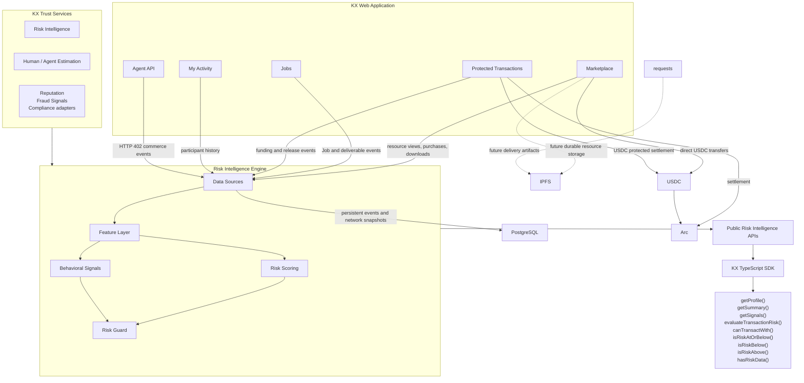

# Component Diagram

This is the main engineering view of KX. It shows how product surfaces, public APIs,
KX Trust Services, the Risk Intelligence Engine, SDK consumers and infrastructure fit together.

## Components

- **KX Web Application**: the user-facing Next.js application.
- **Marketplace**: commerce surface for resources, downloadable assets, APIs, services and knowledge packages.
- **Jobs**: Arc-compatible custom work opportunities between humans, agents and organizations.
- **Protected Transactions**: protected settlement flow for custom work.
- **My Activity**: participant activity and local transaction context.
- **Agent API**: HTTP 402 programmable commerce flow for autonomous clients.
- **KX Trust Services**: reusable services over Arc-compatible Jobs, starting with Risk Intelligence and Human / Agent Estimation.
- **Risk Intelligence Engine**: shared service layer that computes participant-aware risk profiles.
- **Data Sources**: current KX events, with planned external adapters.
- **Feature Layer**: normalized behavior metrics derived from events.
- **Risk Scoring**: preview scoring model for financial behavior, risk tier and confidence.
- **Behavioral Signals**: explainable signals such as activity recency and counterparty diversity.
- **Risk Guard**: pre-transaction policy evaluator returning allow, review or block.
- **Public Risk Intelligence APIs**: public REST endpoints under `/api/risk/*`.
- **KX TypeScript SDK**: internal reusable client for builders and agent workflows.
- **PostgreSQL**: persistent resources, Jobs, activity, network snapshots and risk cache storage.
- **IPFS**: planned durable resource and delivery storage.
- **Arc**: EVM-compatible settlement network.
- **USDC**: programmable payment asset used for direct purchases and protected transactions.
