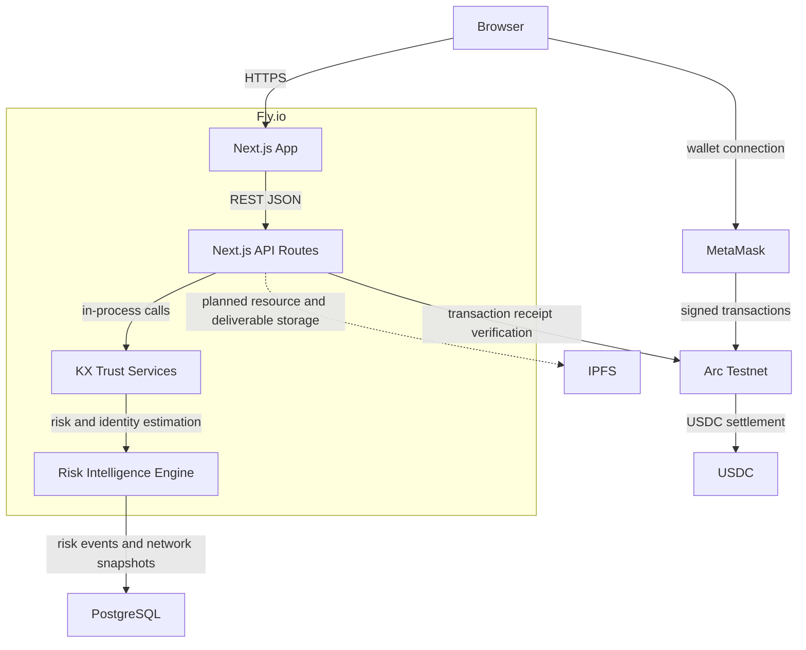

# Deployment Diagram

This diagram shows the runtime architecture for the current MVP and planned storage layers.
The deployed app runs on Fly.io, serves the Next.js application over HTTPS, and interacts with Arc
Testnet through wallet and API flows.

## Components

- **Browser**: user or agent operator interface.
- **MetaMask**: wallet used for Arc Testnet interaction and USDC transactions.
- **Fly.io**: hosting platform for the Next.js runtime.
- **Next.js App**: App Router frontend rendered by the deployed application.
- **Next.js API Routes**: REST JSON endpoints for resources, Jobs, Agent API and Risk Intelligence.
- **KX Trust Services**: service layer over Arc-compatible Jobs for Risk Intelligence and Human / Agent Estimation.
- **Risk Intelligence Engine**: server-side risk profile and Risk Guard logic.
- **PostgreSQL**: durable database for marketplace records, Job drafts, receipts, ratings, risk events and network snapshots.
- **IPFS**: planned durable storage for resource payloads and deliverable artifacts.
- **Arc Testnet**: EVM-compatible network for transaction proofs and settlement.
- **USDC**: payment asset used across marketplace and protected transaction workflows.
